<p align="center">
  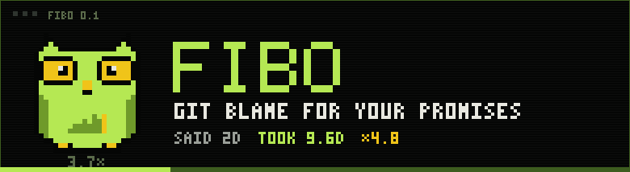
</p>

<h1 align="center">Fibo</h1>

<p align="center"><b>git blame for your promises.</b><br>
You have made a thousand estimates. You have checked none of them.</p>

<p align="center">
  
  
  
  
  
</p>

<p align="center"><sub>GIT HISTORY · TERMINAL · ZERO DEPENDENCIES · NO DATABASE · NO ACCOUNT · NOTHING LEAVES THE MACHINE</sub></p>

<p align="center">
  <a href="#thirty-seconds">start</a> ·
  <a href="#a-promise-with-a-number-on-it">said / took</a> ·
  <a href="#the-multiplier">the multiplier</a> ·
  <a href="#what-it-refuses">refusals</a> ·
  <a href="#on-disk">on disk</a> ·
  <a href="#the-token">the token</a> ·
  <a href="#honest-limits">honest limits</a>
</p>

---

## Film

<p align="center">
  
</p>

<table align="center"><tr>
<td align="center"><br><sub><b>say</b> · writing a promise down</sub></td>
<td align="center"><br><sub><b>one task</b> · taken apart</sub></td>
<td align="center"><br><sub><b>doctor</b> · through the monocle</sub></td>
</tr></table>

## Screens

<p align="center">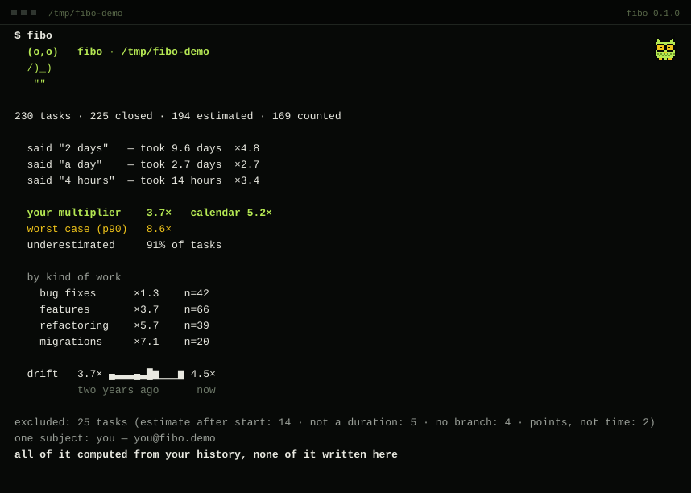</p>

<table align="center"><tr>
<td align="center">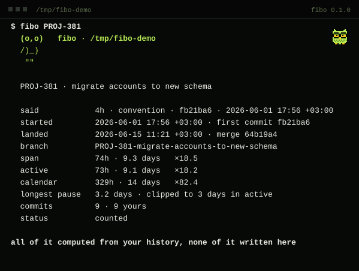<br><sub><b>one task</b> · said, first commit, merge, span, active, the longest pause</sub></td>
<td align="center">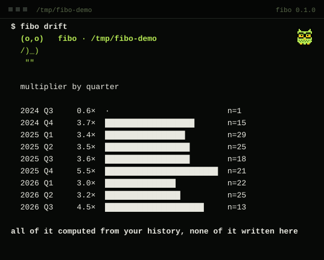<br><sub><b>drift</b> · quarter by quarter</sub></td>
</tr><tr>
<td align="center">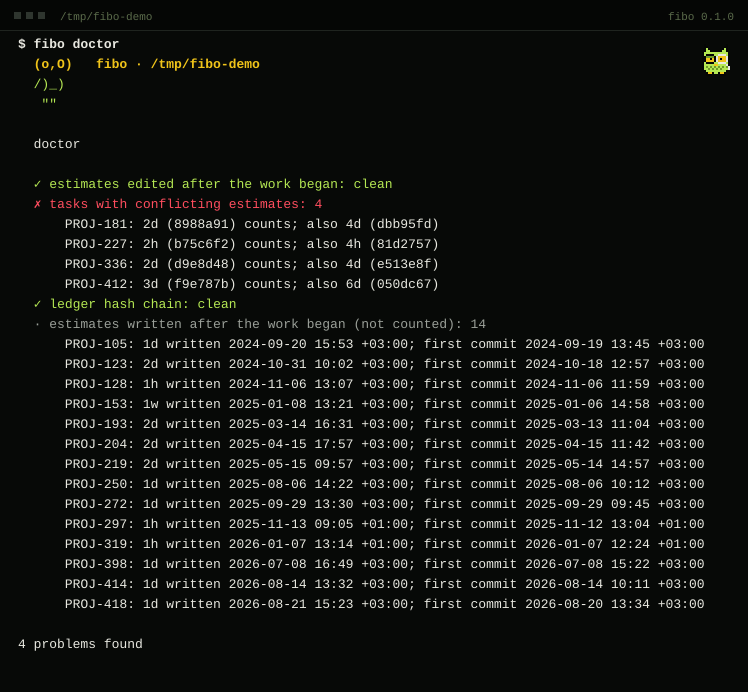<br><sub><b>doctor</b> · four estimates that disagree, fourteen written late, the chain intact</sub></td>
<td align="center">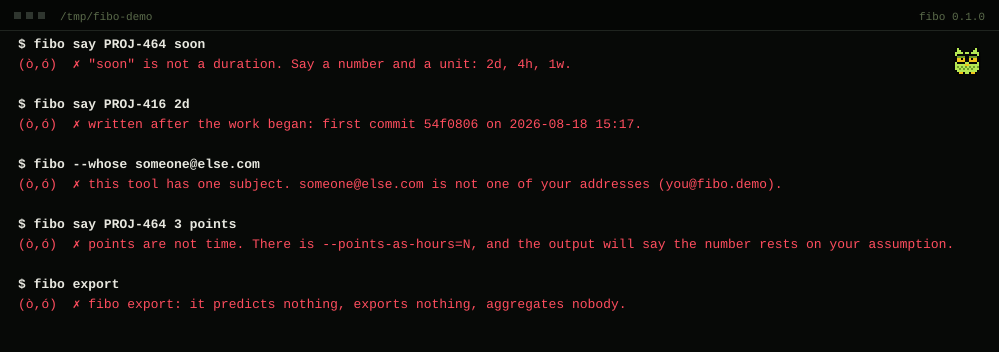<br><sub><b>refusals</b> · five ways to be told no</sub></td>
</tr><tr>
<td align="center">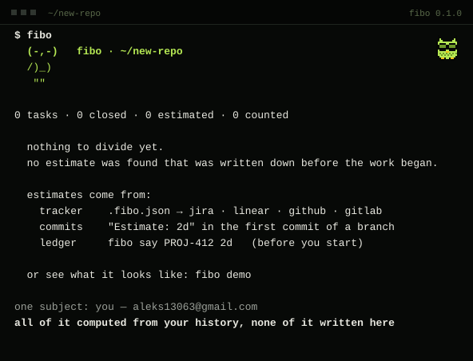<br><sub><b>day one</b> · yours starts empty</sub></td>
<td align="center">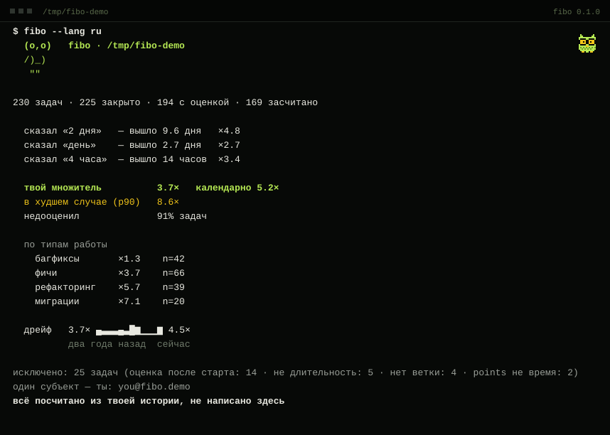<br><sub><b>--lang ru</b> · it speaks Russian too</sub></td>
</tr></table>

<sub>Every picture above is a real transcript: the demo repository, the real commands, drawn by <code>docs/shots.py</code>.</sub>

## Thirty seconds

```sh
pipx install git+https://github.com/0xkuch/Fibo
fibo demo          # two years of made-up history, same numbers on every machine
fibo               # inside your own repository
```

```
  (o,o)   fibo · /tmp/fibo-demo
  /)_)
   ""

230 tasks · 225 closed · 194 estimated · 169 counted

  said "2 days"   — took 9.6 days  ×4.8
  said "a day"    — took 2.7 days  ×2.7
  said "4 hours"  — took 14 hours  ×3.4

  your multiplier    3.7×   calendar 5.2×
  worst case (p90)   8.6×
  underestimated     91% of tasks

  by kind of work
    bug fixes      ×1.3    n=42
    features       ×3.7    n=66
    refactoring    ×5.7    n=39
    migrations     ×7.1    n=20

  drift   3.7× ▄▃▃▃▄▃█▆▁▁▁▆ 4.5×
          two years ago      now

excluded: 25 tasks (estimate after start: 14 · not a duration: 5 · no branch: 4 · points, not time: 2)
one subject: you — you@fibo.demo
all of it computed from your history, none of it written here
```

Yours starts empty. It speaks Russian too (`--lang ru`).

## A promise with a number on it

| | |
|---|---|
| **said** | an estimate written down before the first commit: in your tracker, in the commit, or in the ledger |
| **took** | first commit → merge, in working hours, in the time zone your own commits carry |
| **×** | took ÷ said for every task you finished, and the median of those, taken in log space |

Your tracker already holds years of estimates (Jira, Linear, GitHub, GitLab), so the first run has history to work with. Without a tracker, put `Estimate: 2d` in the first commit of a branch. Without either, `fibo say PROJ-412 2d` writes it down before you start. [Where estimates come from →](docs/sources.md)

> An estimate nobody checks is not an estimate. It is a mood.

## The multiplier

This number is the whole product. It does not tell you to estimate better. It tells you what to multiply by.

- **Median in log space.** ×4 and ×¼ are the same distance from ×1, and the median does not care about the one ×40 disaster. The geometric mean is in `-v`.
- **Working hours.** Mon–Fri, 9–18, in the offset your own commits carried. A day is 8h, a week is 40h. `--calendar` takes both sides literally, shown small.
- **span and active.** span: first commit → merge. active clips any pause over three working days. The gap is how long tasks sat waiting.
- **p90** is the bad day: "in the worst case, ×8.6".
- **By kind of work:** tracker labels, then where the diff went (`migrations/`, `tests/`), then the words in the title. Five tasks to be shown.
- **Drift:** a 90-day rolling median, indexed by when the work landed — indexed by when it began, the last window would fake an improvement.

`fibo PROJ-412` takes one task apart. `fibo drift` shows it quarter by quarter. `fibo doctor` checks that nobody nudged anything.

## What it refuses

```
fibo say PROJ-412 soon          ✗  not a duration
fibo say PROJ-412 2d            ✗  written after the work began
a task with no estimate         ✗  not counted, and not guessed
--whose someone@else.com        ✗  this tool has one subject
story points, no rate given     ✗  points are not time
```

**Not a duration.** "Soon", "by the end of the sprint", "quick" are not estimates. Say a number and a unit.

**Written after the work began.** The program knows when the field changed and when the first commit was made. The value that stood at the first commit counts. `doctor` lists the rest.

**Not guessed.** A task without an estimate gets nothing by analogy, by average or by diff size. It is left out, and the output says so.

**One subject.** Yours. It will not print another person's multiplier, aggregate a team, or export. `--whose` with anyone else's address fails loudly. Trackers are asked for your issues only. There is no JSON, no repository-wide mode, no all-authors mode.

**Points are not time.** `--points-as-hours=N` exists, and the output then says the number rests on your assumption.

> A mirror pointed at someone else is a different object with a different name.

## On disk

```
.fibo.json            optional, yours: who you are, which tracker to ask
.fibo/ledger.jsonl    only if you use `fibo say`; every line hashes the one before
.fibo/ledger.head     the hash of the last line
.fibo/cache/          tracker responses with a TTL; delete it any time
```

That is all of it. No database, no index, no daemon, no server, no account, no telemetry. Every run recomputes from history. With a tracker it only reads — GET and GraphQL queries; a mutation is refused before it is sent. The config loader reads one file and never follows a path to a key.

> A multiplier you can quietly edit after a bad quarter is not a multiplier.

## The token

**$FIB** on Robinhood Chain — a community token. The code does not know it exists: there is no import, no flag, no line in the ledger. `fibo` will never require it and will never print its price.

| | |
|---|---|
| contract | `—` · appears here at launch |
| swap | — |
| chart | — |

```
fibo say $FIB 100x              ✗  not a duration
--whose the-community           ✗  one subject
fibo predict $FIB               ✗  it predicts nothing
```

<sub>not financial advice · the owl is not a financial advisor · it is not even a real owl</sub>

## Roadmap

No dates. This program exists because durations written in advance are wrong by a known factor, and it would have to multiply its own. So: order, not calendar.

```
00  the tool                         ✓
01  the multiplier                   ✓
02  the breakdown by kind of work    ✓
03  the drift                        ✓
04  more sources                     YouTrack, Azure Boards, Shortcut, …
```

## Honest limits

**IT CANNOT SEE THINKING.** The clock starts at the first commit, not at the first thought. Your real multiplier is higher than the one printed.

**IT CANNOT SEE INTERRUPTION.** A branch that sat for a week looks like a week of work. `active` is there for that, and it is still an approximation.

**THE DEMO IS A DEMO.** Reproducible, and nobody's record of promises. Yours starts empty.

**IT DOES NOT KNOW THE RIGHT ANSWER.** There is no correct estimate. It knows what you said and how long it took.

**IT PREDICTS NOTHING.** No model, no opinion. What was written down, what happened, one division.

A squash merge erases the start of the work: the tracker's "In Progress" or a leftover branch fills it in, and without either the task is excluded as "no branch". Time zones come from your commits' offsets, so a laptop set to the wrong zone gets a wrong day.

## Development

```sh
python -m unittest        # 227 tests, stdlib only
python docs/shots.py      # redraws every picture above, from the real output
```

---

<p align="center"><sub>MIT · built for the fun of it · <code>(-,-)</code> the owl has seen enough</sub></p>
